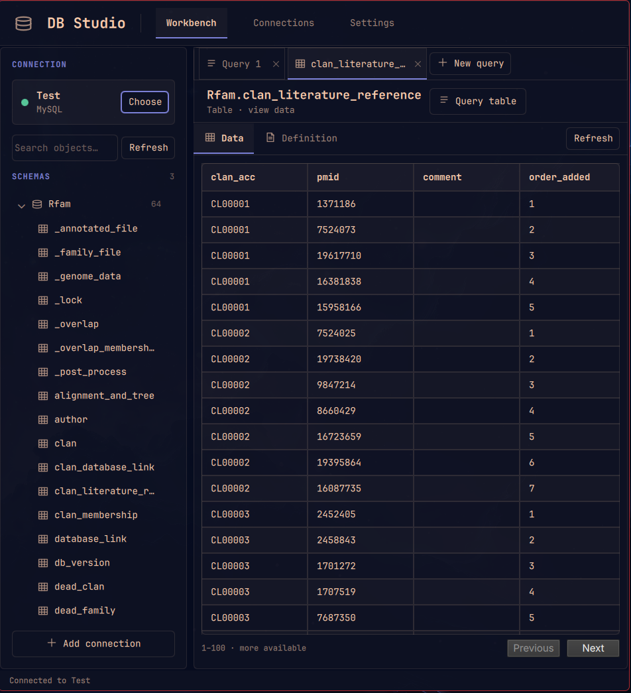

# DB Studio for Omarchy

**Browse SQL Server, Azure SQL, MySQL, and PostgreSQL from one workbench.**

Choose a connection, explore its schemas, open a table or view, inspect its definition, and run SQL without leaving your flow. Keep multiple connection profiles and switch between them when your work moves to another server or database. One connection is active at a time.



## Explore your databases

- **Find what you need.** Search schemas, tables, and views from the sidebar. Empty schemas stay out of the way.
- **Inspect data and structure.** Open a table or view to page through rows, or see its columns, keys, and indexes in **Definition**. The data grid is view-only in v1.
- **Run SQL.** Work in multiple query tabs, use `Ctrl+Enter` to run a query, cancel a long-running query, and expand or resize the results area.
- **Draft or fix SQL with AI.** Click **✦ Ask AI** beside **Run query**, describe the query you want or ask for a repair, and review the suggested SQL before choosing **Use in editor**. DB Studio uses the current tab's SQL and its last query error as context. It never runs the suggestion automatically.
- **Keep results manageable.** Queries and table pages start at 100 rows. Set a default from 1 to 1,000 in **Settings**; DB Studio caps rows delivered for a query even when its `SELECT` has no `LIMIT` or `TOP`.
- **Move between databases.** On SQL Server and Azure SQL, click the current database in the sidebar to open a full-height picker. Search the list or enter a database name directly, then choose one to return to the schema browser. MySQL shows accessible databases in the schema tree. For PostgreSQL, connect to a specific database and browse its schemas.

| Database | Connection and browsing |
| --- | --- |
| SQL Server | SQL username/password; browse the current database and switch to other accessible databases. |
| Azure SQL | SQL username/password with encrypted, validated connections; browse and switch databases your account can access. |
| MySQL | Connection URL, driver string, or form fields; browse accessible databases in the sidebar. An empty password is supported. |
| PostgreSQL | Connection URL or form fields; browse schemas in the connected database. Use another profile to connect to another database. |

## Requirements

- Omarchy with the Quickshell plugin system.
- Node.js 20 or newer and npm. The setup script installs npm and its Node.js dependency through Omarchy if needed.
- A Secret Service compatible desktop keyring and `secret-tool` if you want to remember connections. Without a usable keyring, connections work for the current DB Studio session only.
- For AI query drafting, an Omarchy default coding agent set to Codex with a signed-in Codex CLI. Other Omarchy agents are not supported by the in-panel AI action yet.

## AI query context

AI drafting sends your request, current SQL, last query error, database dialect, and relevant schema metadata to the selected Codex provider. DB Studio first sends a compact catalog of table and view names (up to 18,000 characters), then sends column names and types for at most eight relevant objects (up to 14,000 characters). The prompt excludes connection strings, passwords, row values, column defaults, and indexes. If the catalog is too large or the needed columns cannot be read, the assistant may ask for a more specific request rather than guessing.

The AI action runs `codex exec` in noninteractive, ephemeral, read-only mode. Its draft replaces the open query tab only after you choose **Use in editor**; **Run query** remains a separate action.

## Install

**Marketplace availability: Manual setup.** Omarchy installs the plugin source but does not run setup scripts. Run the second command below to install DB Studio's database drivers and launcher. The marketplace's **Snapshot verified** status covers the listed source commit; it does not remove this setup step.

Run these two commands in a terminal:

```bash
omarchy plugin add https://github.com/Andean-Bridge/omarchy-db-browser.git --enable
bash "$HOME/.config/omarchy/plugins/andean-bridge.db-browser/setup.sh"
```

The setup script installs npm and Node.js if needed, installs the locked database drivers with `npm ci --omit=dev --no-bin-links`, adds the app-launcher entry and icon, and opens DB Studio. Run it again after an update that changes the Node dependencies. `--no-bin-links` avoids symlinks that the plugin validator rejects.

## Remove

```bash
omarchy plugin remove andean-bridge.db-browser
rm -f ~/.local/share/applications/db-studio.desktop
rm -f ~/.local/share/icons/hicolor/scalable/apps/db-studio.svg
```

Removing the plugin does not delete saved connection profiles or keyring secrets.

## Connection profiles and secrets

Create a named connection by pasting a connection string or filling in the fields. The SQL Server and Azure SQL drivers accept ADO-style strings; MySQL accepts a URL or driver string; PostgreSQL accepts a `postgres://` or `postgresql://` URL. In **Connections**, you can duplicate a saved or session-only profile.

Selecting **Remember connection** stores the **entire connection string** in the desktop keyring as one secret. For connections entered through fields, DB Studio stores one serialized connection definition there instead. The local profile file at `${XDG_CONFIG_HOME:-~/.config}/omarchy/db-browser/connections.json` contains only an opaque ID, display name, and database type, with private file permissions. The keyring provider controls encryption and unlocking; DB Studio does not implement its own encryption.

The edit form indicates when a secret is stored but does not reveal it. Leave the connection fields blank to keep the saved secret, or enter new details to replace it. If no usable keyring is available, DB Studio can keep a connection for the current session only. It does not save query history or result data.

## V1 notes

- The table grid is read-only. SQL entered in the editor runs with the connected account's permissions and can modify data.
- SQL Server and Azure SQL use SQL username/password authentication. Integrated Security, named instances without a TCP port, and Microsoft Entra interactive authentication are not supported yet.
- The MySQL form allows a blank password. New field-based connections start with verified TLS; turn it off explicitly for a local server that does not support TLS. PostgreSQL URLs default to verified TLS, and MySQL URLs or driver strings default to verified TLS for non-local hosts. Use `sslmode=disable` or `ssl=false` in a pasted string only when plaintext is intended. Existing saved profiles with TLS disabled retain that choice; DB Studio marks unencrypted remote connections. Azure SQL always requires encryption and certificate validation.
- Switching SQL Server or Azure SQL databases lasts for the current connection. Reopening a saved profile returns to its original database. Some Azure SQL logins cannot list every database; you can enter an accessible name directly.
- Query results display only the first result set. The row cap limits data delivered to DB Studio, though the server may still do work before the stream is stopped. Table pages have no guaranteed ordering, so rows may shift when underlying data changes.
- PostgreSQL can list objects the login cannot read. A `42501` error explains whether schema `USAGE` or table or view `SELECT` access is missing.

## Development

```bash
npm ci --no-bin-links
npm test
omarchy plugin validate .
/usr/lib/qt6/bin/qmllint -I "${OMARCHY_PATH:-/usr/share/omarchy}/shell" DbStudioPanel.qml DbGrid.qml
```

Live connection checks require a reachable database and credentials; the repository's automated checks do not connect to user databases.

## License

[MIT](LICENSE). Copyright © 2026 Andean Bridge.
