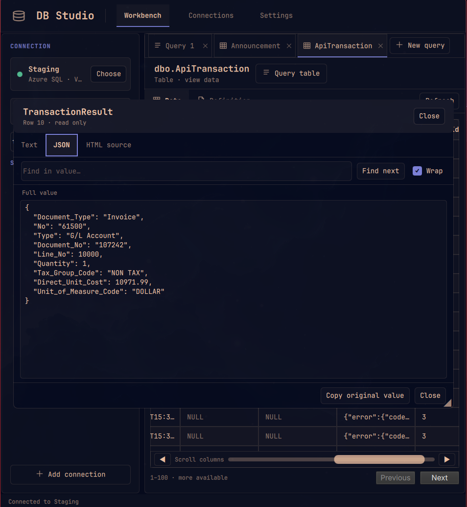

# DB Studio for Omarchy

**Browse SQL Server, Azure SQL, MySQL, and PostgreSQL from one workbench.**

Choose a connection, explore its schemas, open a table or view, inspect its definition, and run SQL without leaving your flow. Keep multiple connection profiles and switch between them when your work moves to another server or database. One connection is active at a time.


## Explore your databases

- **Find what you need.** Search schemas, tables, and views from the sidebar. Empty schemas stay out of the way.
- **Inspect data and structure.** Open a table or view to page through rows, or see its columns, keys, and indexes in **Definition**. The data grid is view-only in v1.
- **Read individual values.** Select a cell, then double-click or press Enter to open a resizable, read-only viewer. Search and wrap text, format valid JSON, or inspect HTML as source. Right-click a cell to copy its full value or column name.
- **Run SQL.** Work in multiple query tabs, use `Ctrl+Enter` to run a query, cancel a long-running query, and expand or resize the results area.
- **Draft or fix SQL with AI.** When Omarchy's default agent is Codex and its CLI is installed and signed in, **✦ Ask AI** appears beside **Run query**. Describe the query you want or ask for a repair, then review the suggested SQL before choosing **Use in editor**. DB Studio uses the current tab's SQL and its last query error as context. It never runs the suggestion automatically.
- **Keep results manageable.** Queries and table pages start at 100 rows. Set a default from 1 to 1,000 in **Settings**; DB Studio caps rows delivered for a query even when its `SELECT` has no `LIMIT` or `TOP`. This is a default result size, not a database work or affected-row limit.
- **Move between databases.** On SQL Server and Azure SQL, click the current database in the sidebar to open a full-height picker. Search the list or enter a database name directly, then choose one to return to the schema browser. MySQL shows accessible databases in the schema tree. For PostgreSQL, connect to a specific database and browse its schemas.

### Inspect a cell value

Open a cell to read long text, formatted JSON, or HTML source. Search within the value and copy the original contents from the read-only viewer.



| Database | Connection and browsing |
| --- | --- |
| SQL Server | SQL username/password; browse the current database and switch to other accessible databases. |
| Azure SQL | SQL username/password with encrypted, validated connections; browse and switch databases your account can access. |
| MySQL | Connection URL, driver string, or form fields; browse accessible databases in the sidebar. An empty password is supported. |
| PostgreSQL | Connection URL or form fields; browse schemas in the connected database. Use another profile to connect to another database. |

## Requirements

- Omarchy with the Quickshell plugin system.
- Node.js 20 or newer and npm. The setup script installs npm and its Node.js dependency through Omarchy if needed.
- `flock` (util-linux) for serializing agent requests to the same connection profile.
- A Secret Service compatible desktop keyring and `secret-tool` if you want to remember connections. Without a usable keyring, connections work for the current DB Studio session only.
- For AI query drafting, an Omarchy default coding agent set to Codex with an installed, signed-in Codex CLI. Other Omarchy agents are not supported by the in-panel AI action yet; the button stays hidden for them.

## AI query context

AI drafting sends your request, current SQL, last query error, database dialect, and relevant schema metadata to the selected Codex provider. DB Studio first sends a compact catalog of table and view names (up to 18,000 characters), then sends column names and types for at most eight relevant objects (up to 14,000 characters). The prompt excludes connection strings, passwords, row values, column defaults, and indexes. If the catalog is too large or the needed columns cannot be read, the assistant may ask for a more specific request rather than guessing.

DB Studio checks the Omarchy default agent and `codex login status` when the panel opens. If Codex is absent or signed out, **Ask AI** stays hidden; database browsing and SQL queries still work. The AI action runs `codex exec` in noninteractive, ephemeral, read-only mode. Its draft replaces the open query tab only after you choose **Use in editor**; **Run query** remains a separate action.

## Local AI agent access

DB Studio includes a local CLI and MCP server so coding agents can inspect schemas, browse tables, and run SQL through remembered connection profiles. This is separate from the in-panel **Ask AI** drafting action. Agent access is off for every profile until you edit it, keep **Remember connection** on, and check **Allow AI agents to use this connection**. The connection list shows **AI access on** for enabled profiles. Duplicates start with access off. Turning the setting off prevents subsequent DB Studio CLI and MCP requests from opening that profile; an in-flight query may finish.

When the CLI or MCP connection list is empty, an agent should stop and tell you to open DB Studio and enable AI access on a remembered connection. It should not offer to change the setting, inspect disabled profiles, or open a connection through the raw worker. Enabling access is your action in the DB Studio interface.

Omarchy teaches its coding agents about the desktop through a `SKILL.md` directory linked into each agent's skill location. DB Studio's setup uses the same mechanism for its [DB Studio skill](skills/db-studio/SKILL.md): it links the skill into Codex, Claude, Pi, and Hermes skill directories. The agent loads the skill when a database task matches its description, or you can invoke it directly as `$db-studio` in Codex or `/db-studio` in Claude. The skill teaches tool names and discovery steps; the MCP server or CLI provides live database access. Restart an existing agent session if the new skill does not appear.

The consent text in the connection form explains the data flow: an agent can run SQL with the saved account's database permissions, including changes if allowed, and query results may be sent to its AI provider. DB Studio tool responses omit keyring credentials. An agent with shell access under your user account can access local files and may access the same keyring; the profile setting is a cooperative control, not an isolation boundary. Use a read-only database account if you want to prevent changes. Session-only profiles are unavailable because a separate agent process cannot reopen them.

Run the CLI after setup:

```bash
db-studio profiles
db-studio schemas --profile "My database"
db-studio objects --profile "My database" --schema public
db-studio describe --profile "My database" --schema public --name users
db-studio rows --profile "My database" --schema public --name users --limit 20
db-studio query --profile "My database" --sql 'SELECT COUNT(*) FROM users'
```

The command prints JSON to stdout. Use `db-studio query --profile "My database" --file query.sql` for a SQL file, or `--file -` for stdin. SQL input is limited to 200 KB. Omit `--limit` (or the MCP `limit` argument) to use the app's saved default result limit; an explicit value overrides it, up to 1,000 rows. The cap limits returned rows, not server work or rows changed by SQL. Agent calls for the same profile run one at a time and wait up to 30 seconds for a busy connection. MCP cancellation requests stop an active query when the database driver supports cancellation. Large cell values appear as previews with `truncatedCells` metadata; the short-lived cell handles are not exposed after the CLI or MCP call closes its connection.

To connect an Omarchy agent, point its local stdio MCP configuration at `node $HOME/.config/omarchy/plugins/andean-bridge.db-browser/backend/mcp.mjs`. For example:

```bash
codex mcp add db-studio -- node "$HOME/.config/omarchy/plugins/andean-bridge.db-browser/backend/mcp.mjs"
claude mcp add --scope user db-studio -- node "$HOME/.config/omarchy/plugins/andean-bridge.db-browser/backend/mcp.mjs"
gemini mcp add --scope user db-studio node "$HOME/.config/omarchy/plugins/andean-bridge.db-browser/backend/mcp.mjs"
```

Other MCP clients can use the same command and absolute path. DB Studio exposes `list_connections`, `list_schemas`, `list_objects`, `describe_table`, `read_rows`, and `run_query`. Each client starts its own local server process. The Omarchy agent launcher does not configure MCP servers on behalf of those clients.

For OpenCode, add a local server under `mcp` in `~/.config/opencode/opencode.json`, using an absolute path to `backend/mcp.mjs`:

```json
{
  "mcp": {
    "db-studio": {
      "type": "local",
      "command": ["node", "/home/YOUR_USER/.config/omarchy/plugins/andean-bridge.db-browser/backend/mcp.mjs"],
      "enabled": true
    }
  }
}
```

Gemini CLI suppresses MCP servers in folders it has not been asked to trust. Complete its normal workspace trust and authentication prompts when launching it. Any Omarchy agent with shell access can also use the `db-studio` CLI directly.

## Install

**Marketplace availability: Manual setup.** Omarchy installs the plugin source but does not run setup scripts. Run the second command below to install DB Studio's database drivers and launcher. The marketplace's **Snapshot verified** status covers the listed source commit; it does not remove this setup step.

Run these two commands in a terminal:

```bash
omarchy plugin add https://github.com/Andean-Bridge/omarchy-db-browser.git --enable
bash "$HOME/.config/omarchy/plugins/andean-bridge.db-browser/setup.sh"
```

The setup script installs npm and Node.js if needed, installs the locked database drivers and MCP server with `npm ci --omit=dev --no-bin-links`, adds the app-launcher entry, icon, `~/.local/bin/db-studio` command, and agent skill links, then opens DB Studio. Run it again after an update that changes the Node dependencies. `--no-bin-links` avoids symlinks inside the plugin that the validator rejects.

## Remove

```bash
bash "$HOME/.config/omarchy/plugins/andean-bridge.db-browser/uninstall.sh"
omarchy plugin remove andean-bridge.db-browser
```

Run the cleanup script before removing the plugin. It removes only launcher files matching this plugin and links pointing into this installation; it preserves unrelated files, saved connection profiles, and keyring secrets.

## Connection profiles and secrets

Create a named connection by pasting a connection string or filling in the fields. The SQL Server and Azure SQL drivers accept ADO-style strings; MySQL accepts a URL or driver string; PostgreSQL accepts a `postgres://` or `postgresql://` URL. In **Connections**, you can duplicate a saved or session-only profile.

Selecting **Remember connection** stores the **entire connection string** in the desktop keyring as one secret. For connections entered through fields, DB Studio stores one serialized connection definition there instead. The local profile file at `${XDG_CONFIG_HOME:-~/.config}/omarchy/db-browser/connections.json` contains only an opaque ID, display name, and database type, with private file permissions. The keyring provider controls encryption and unlocking; DB Studio does not implement its own encryption.

The edit form indicates when a secret is stored but does not reveal it. Leave the connection fields blank to keep the saved secret, or enter new details to replace it. If no usable keyring is available, DB Studio can keep a connection for the current session only. It does not save query history or result data to disk. Full values behind shortened grid previews are held temporarily in worker memory, with a 5 MB limit per value and a 20 MB total cache limit; they expire after five minutes or when the connection closes. If a value exceeds the limit or expires, the viewer labels the shortened value as a preview and disables full-value copy.

## V1 notes

- The table grid and cell viewer are read-only. SQL entered in the editor runs with the connected account's permissions and can modify data.
- SQL Server and Azure SQL use SQL username/password authentication. Integrated Security, named instances without a TCP port, and Microsoft Entra interactive authentication are not supported yet.
- The MySQL form allows a blank password. New field-based connections start with verified TLS; turn it off explicitly for a local server that does not support TLS. PostgreSQL URLs default to verified TLS, and MySQL URLs or driver strings default to verified TLS for non-local hosts. Use `sslmode=disable` or `ssl=false` in a pasted string only when plaintext is intended. Existing saved profiles with TLS disabled retain that choice; DB Studio marks unencrypted remote connections. Azure SQL always requires encryption and certificate validation.
- Switching SQL Server or Azure SQL databases lasts for the current connection. Reopening a saved profile returns to its original database. Some Azure SQL logins cannot list every database; you can enter an accessible name directly.
- Query results display only the first result set. The row cap limits data delivered to DB Studio, though the server may still do work before the stream is stopped. Table pages have no guaranteed ordering, so rows may shift when underlying data changes.
- PostgreSQL can list objects the login cannot read. A `42501` error explains whether schema `USAGE` or table or view `SELECT` access is missing.

## Development

```bash
npm ci --no-bin-links
npm test
omarchy plugin validate .
/usr/lib/qt6/bin/qmllint -I "${OMARCHY_PATH:-/usr/share/omarchy}/shell" DbStudioPanel.qml DbGrid.qml
```

Live connection checks require a reachable database and credentials; the repository's automated checks do not connect to user databases.

## License

[MIT](LICENSE). Copyright © 2026 Andean Bridge.
